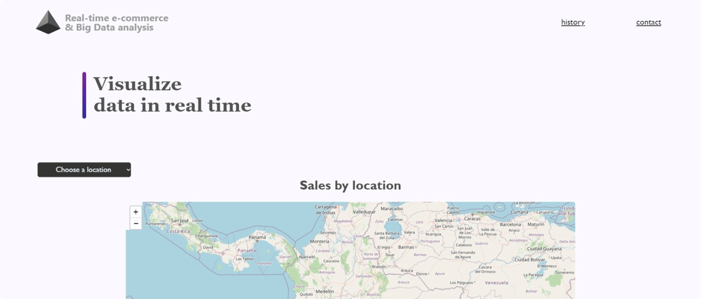

# Real time e-commerce & Big Data analysis

## Description


## Learning Objectives

* Put into practice what was learned during the Foundations phase at Holberton School.
* Highlights a Student’s unique interests and background when networking, or interviewing with potential employers.
* Provides a realistic workplace scenario where engineers create a solution to fit loosely defined requirements, break this down into concrete tasks and implement on a deadline.
* Allows for self-directed learning to explore a new technical topic, deepen understanding of a curriculum-covered topic, or use technology to bring an idea to life.

## Tecnologies

### Database:

MySQL-PosgreSql-Cassandra

### Backend:

**Programming language:** Python\
**Messaging:** Apache-Kafka\
**Ingestion - Analysis:** Apache-Spark

### Frontend:

**Standard:** HTML5\
**Framework:** Flask\
**Maps:** Leaflet\
**Graphics:** D3.js

## Development

Clone the repository
```
$ git clone https://github.com/ch-ov/Real-time-e-commerce-Big-Data-analysis
```

## Authors

* [Jaime Rodriguez](https://github.com/soft-insight)
* [Steward Valdez](https://github.com/Stewardvr93)
* [Christian Oviedo](https://github.com/ch-ov)